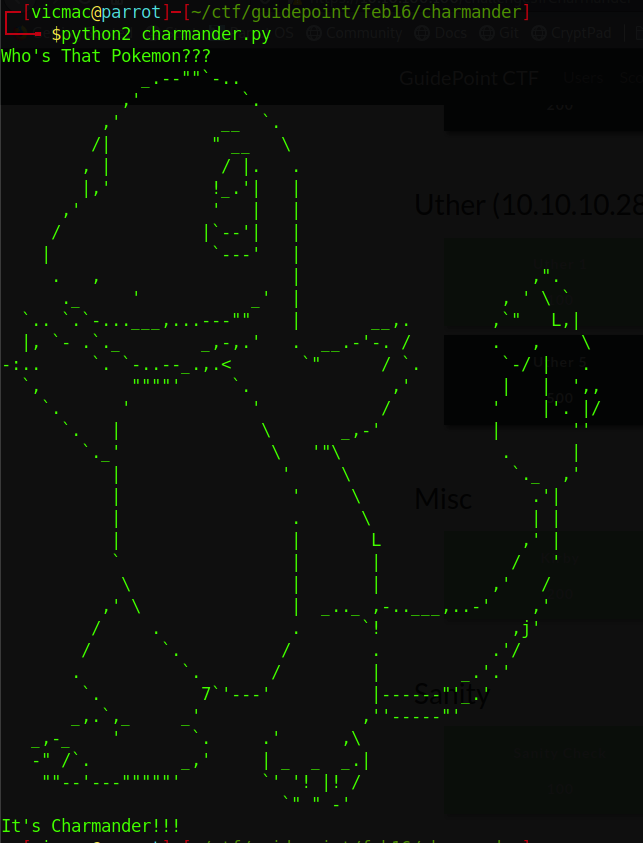
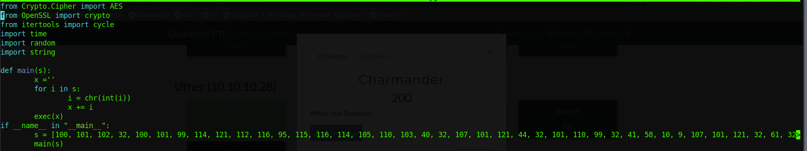
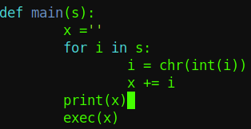
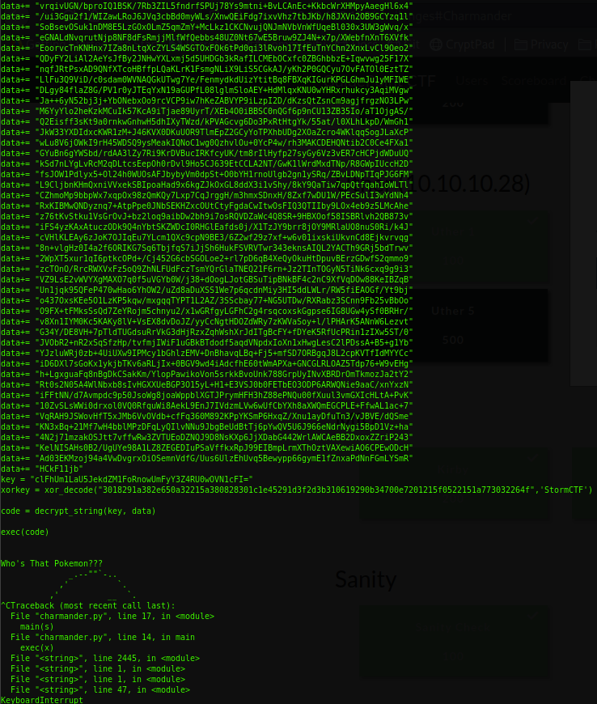
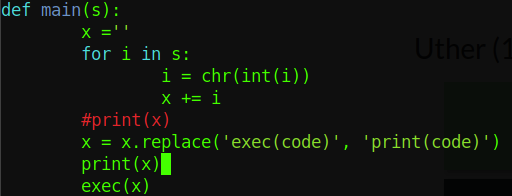
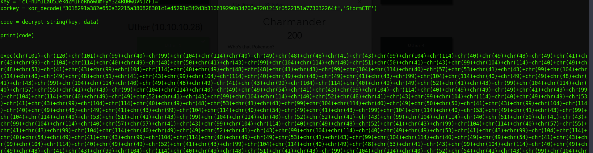
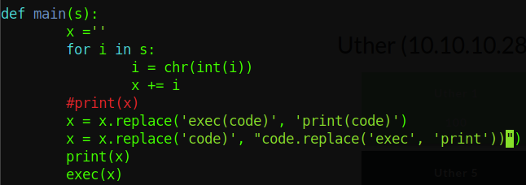
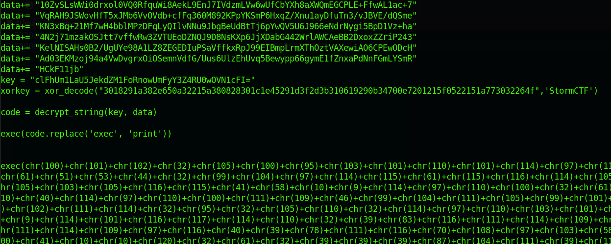
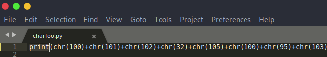
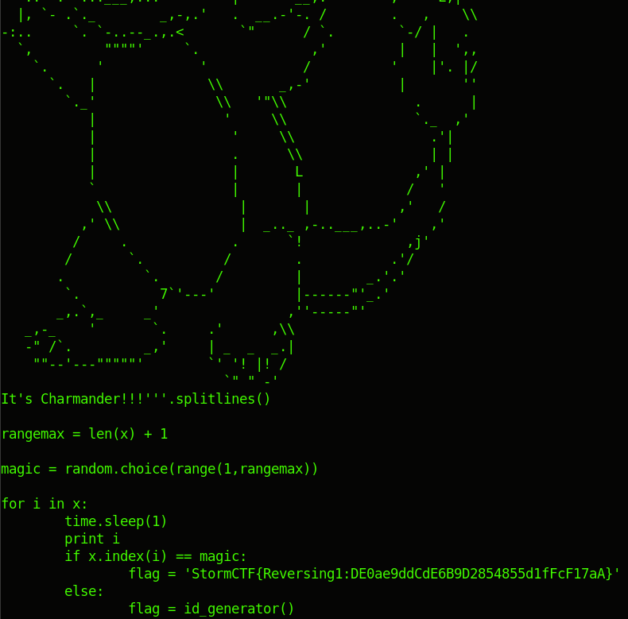

# Charmander, Char!

We're on a roll! So let's do this one too.

Download the charmander.py file and run it.

```
$ python2 charmander.py
```




# Awwww

But it's not a flag! Let's examine the code



# >.>

No biggie, let's add a print statement before the exec to see what's really happening (yes, I use nano, deal with it)





# Oof!

So from the looks of it, we have data, a key which is XORed with the String StormCTF and then used to decrypt the data, which turns out to be mooooore code fed into another exec.

We'll now substitute the exec statement with a print. EZPZ.





# OGODNO

Another exec with a bunch of chars inside. We replace again and run. We restore the original exec for the inner code to print. This is some string foo, but I didnt want to copy and paste back and forth on an editor. (Do it, its less painful -.-)




# ?

So we're back to the exec? Did I do something wrong? I lost a lot of time here! But upon closer examination you can confirm that the outputs are different, last one started with a 101 char value, and this one starts with 100. I got tired of this and copied the remaining code to Sublime and edited there (told you!)




Aaaaand run again!



So we submit the flag and 200 more points!