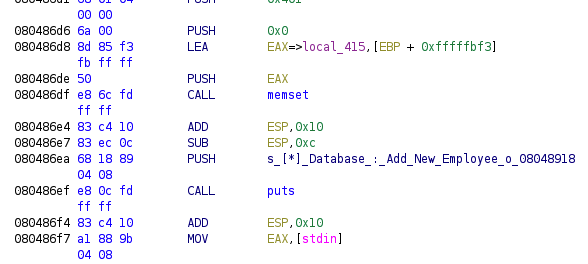
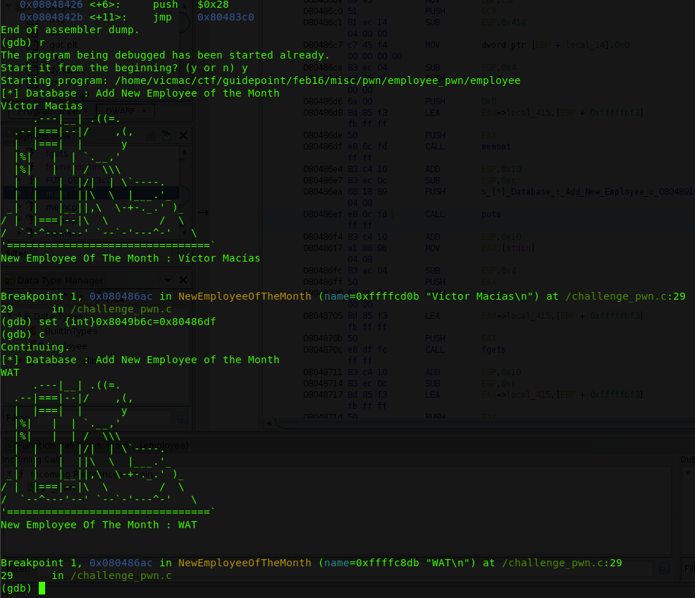
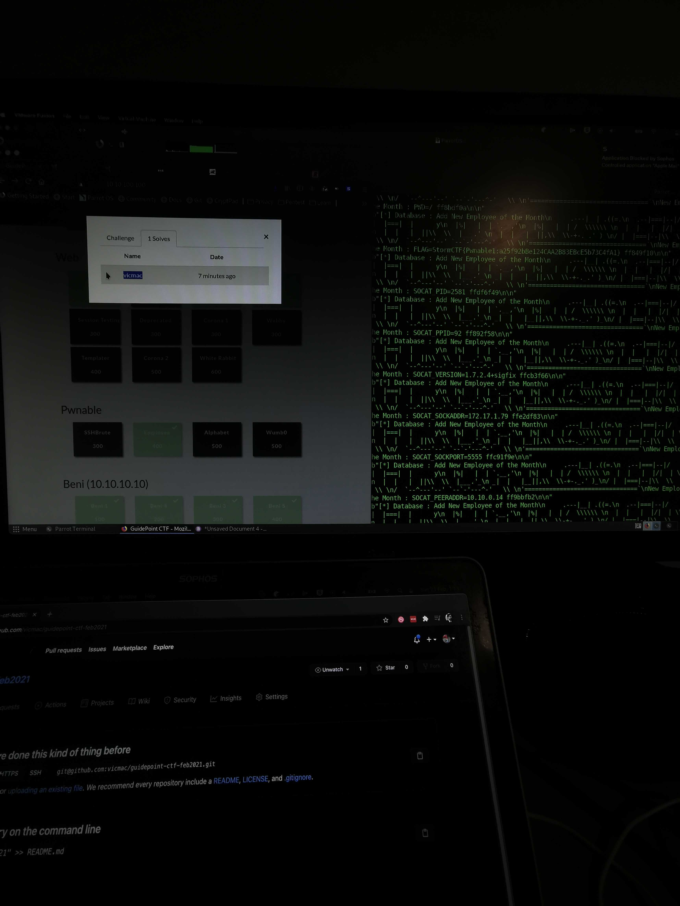

# Employee

So there it is, the binary exploitation challenge I've been waiting to try and beat. Been watching so many LiveOverflow's and John Hammond's videos that I'm sure I can do this. 400 pts. Let's go.

I couldn't get any captures since the CTF dropped VPN access before I could do this writeup, so some images were taken using my phone. I tried a bunch of dumb stuff before getting in the right direction, so bear :bear: with me.

The challenge was simple. Download the binary and get the flag!

Se we run a rustscan on the host and find 2 open ports.

I probed with netcat for the first port


We have connection and it waits for input. We type. It responds and closes the connection. Not much right now.

What about the other port? It seems it's an http server of some sort. But the root is empty. We run gobuster using the common wordlist.


_Missing screencaps, sorry :(. I got the previous command from my bash history_

Aaaaand we get 
```/employee```
as a valid route. We visit and... voilá! The employee binary is now been downloaded.

Pulled out the big guns and ran Ghidra to poke through the code.


Looking for some nasty ```gets``` or ```scanf``` on main, but came empty-handed. This program uses ```fgets```, so no easy exploits there. Now let's check the NewEmployeeOfTheMonth function.


Some puts and printfs for the ASCII art, and then a ```printf``` with the buffer that was read on main...

## Aha!

So this blindly prints the buffer that was so carefully read on main. Great! Just like in those videos I saw! So the first thing I think about is overwriting the return address of the function to land somewhere else. Let's get to it.

First thing to notice. This function does not return. ¬¬

There is an exit(0) call before we hit the end of the function, terminating the program right there. Just my luck.

So I remember I watched LiveOverflow divert the execution from an exit function call by overwriting the Global Offset Table (GOT). It seems I'm connecting the dots!

https://www.youtube.com/watch?v=t1LH9D5cuK4

So we run the program using gdb and set a breakpoint just before the exit function call.


When the binary calls exit, it actually is checking in the GOT the address for that function, and jumping into it (JMP).


So now we need to change the JMP destination. We find the GOT entry for exit:

```$ dissasemble NewEmployeeOfTheMonth```


And overwrite it with... ? At this point I didn't even know where to jump. I rushed to test this. I wanted to learn how to do it properly and I was excited doing it like in the Youtube videos!

So I choose an arbitrary execution point in the main function



and put the address in the GOT


Aaaaand... Action! SEGFAULT! -.-


## Huh?

So I was still getting to know this, but obviously jumping into the middle of a function does not guarantee that it will work as expected since all the program state may not be properly set for the next instruction. So I kept using different addresses until I got "correct" execution.




## :D

It was just looping between main and the NewEmployeeOfTheMonth function. But it worked! So now I moved to do it without gdb.

printf documentation clearly states that %n is dangerous since it writes directly to memory.


Which is what we intend to to. So we need to:


+ Put the GOT address somewhere so the printf function can reach it. The only thing at that point which can be manipulated is the string read from main, so that should do the trick.
+ Print as many chars as needed to overwrite the GOT address with our selected address. And cross our fingers!

Probe the binary. Since it's letting us input arbitrary strings to printf, lets use %x to leak the contents on the stack. Why that happens? Since printf uses a vararg internally to handle additional parameters, those parameters (along with the format string) are expected to be pushed to the stack before the printf gets called. If we input any format markers to the string it will walk down the stack and will output any values in there according to the format marker.

My string of choice was AAAABBBBCCCCDDDD %x %x %x %x %x %x %x %x		


Neat! So now we know we can get to the string using the 8th argument. Another neat trick of printf is using the %1$x which tell's printf exactly which arg to print. We do some alignment trickery and...

AAAABBBBCCCCDDDD %8$x


We get directly to out arbitrary data. Neat.

At this point I started to write a Python script to create the outputs. The final script is also available here. So the first draft looked like this:


And using some bash:

```
python2 employee_exploit.py > input
./employee < input
```

I could quickly iterate and fix any smaller issues.

So now lets write our target address in the input and make sure we can access it using the format markers.


Nice! Now we need to overwrite that address. With another address. We need chars. A lot of them. 0x080486df of them.

You notice that our buffer only contains 1024 chars. And 1024 is nowhere near 0x080486df. So how? Enter another printf trickery.

I don't know about you but in University I got a pretty good hold of C so I knew beforehand you could use a special notation that lets you add padding chars to the output of format markers (and LiveOverflow also goes through it). So we need to print 0x080486df chars (minus the padding string). So be it (Math ahead):

```
0x080486df - 1 (0x90) - 8 (GOT, twice) - 4 (AAAA) - 1 (Extra space after formatted marker) = 134514385
```

_Why GOT twice? I was trying to also overwrite the GOT address using the split-write LiveOverflow uses, but it kept crashing on me so I eventually omitted it and joined the 2 different addresses to write into this instruction_

We create the input file and feed it to the employee program.


This takes ages! It's printing a lot of useless chars and outputing to the stdin file/stream is actually kinda expensive, so this delays execution, big time.


We finally get the address to which we would write should we change the last %x marker for %n. It's doubled because we sent two %8$x markers, one with padding and one without it. It matches the address we wanted to overwrite. We change it to %8$n and run again

_I'm gonna spare you all the off-by-one errors I had here. There were. A lot. It happens, I guess._

Open in gdb. Set a breakpoint before the exit call and... Run.

We get a breakpoint hit. How exciting! Check the GOT table.


We got a winner! We let it run and it loops to main until it segfaults. Yay?

## Now what?

So I was kinda blind, it was late and I had some work to do the next day. So I dropped this to let my mind rest and start fresh later on.

And that's when it hit me. Where am I jumping to? Where's the flag? Why did I do all this?

## >.>

I did aaaaall this because I'm dumb. I didn't even check if there was somewhere to jump to. And there wasn't! But hey, at least now I overwrote the GOT in real life! How cool is that?!? :D

## Start over?

I got so frustrated to have wasted all my time doing nothing. :((

So now I needed a different approach. Honestly I started thinking about shellcode, ret2libc, no-op sleds and stuff. But then I thought: 400 points for shellcode or ret2libc in a "beginners" CTF? No way. It's gotta be simpler. The only equivalent flag I got was Beni 4 which was accessing a root owned file using sudo and xz. No way.

I kept thinking. What if the program is being executed with the flag as a program argument? An envvar? Where does that get stored?

## The stack. Leak it.

I started to kinda brute-force leaking the strings in the stack using %s but I was not achieving anything. Ran the program in gdb passing a simple string as argument (using perritow here) and started checking the stack for it.


So it appears it does indeed appear in the stack, near the envvars. That's the next objective.

Now I try to guess the stack address via trial-and-error in the remote binary. But no. This is futile. I'm getting nowhere and now I am frustrated and tired. I decided to sleep instead. I'll figure it out during the weekend. I had a lot of work to do and maybe my mind will be clearer then.

In the meanwhile, I was scrolling on ideas on how to leak the stack and no other than John Hammond did this already. See: https://www.youtube.com/watch?v=EmLfoR-k_l0

Basically we have infinite executions in the remote binary (there's no throttle that I'm aware of) so we can write a script to walk down the stack frame by frame using the positional argument notation in the format marker. Just as easy as a for loop and watch the output for any flag-like data. We also print the arg index so we can resume in case something fails.


## Drumroll... :drum:




There it is! Indeed it was on the stack, not as an argument but as an envvar, FLAG (surprise!). I took photos to swag it on Instagram and submitted the flag.

The flag was actually at offset 583, so I wrote a better algorithm to leak the flag quicker, only checking in the nearby addresses


## 400! :D

What a journey! I went down in the wrong rabbit hole in the beginning but it really solidified my knowledge on how to explore binaries, read them, how assembly works (I haven't really touched anything related since I was in school), and it also really made me happy to be the first one in the CTF to solve it. :D
I think the last time I checked the counter was at 3. And the other 2 players we're really high in the scoreboard, so I guess it was piece of cake for them.