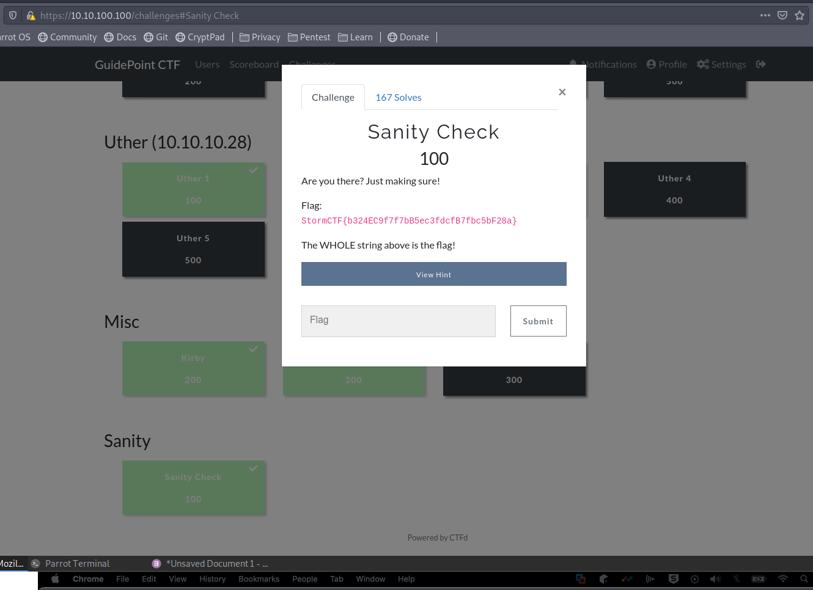

# Game on!

So the day finally came.

I booted my VM and visited the page. The portal was open and I got my .ovpn file. 

So I promptly made a simple directory structure to _supposedly_ have everything organized. This helped but at the end I had a huge mess. I need to work on that!

```
$ mkdir -p /home/vicmac/ctf/guidepointctf/feb16

$ cd /home/vicmac/ctf/guidepointctf/feb16

$ mv /home/vicmac/Downloads/myvpnconfig.ovpn /home/vicmac/ctf/guidepointctf

$ sudo myvpncconfig.ovpn
```

After some exciting output from openvpn y could finally visit the CTF home page (10.10.100.100/challenges). Created my profile (vicmac of course) and got in!

")

The challenges page had a lot to pick from, from a past video from John Hammond I remember there was an easy flag _Sanity Check_, so I went for the quick buck and just copy+pasted the flag for the firsts 100 pts. Yay!




I started with the low hanging fruit to boost my morale and take on harder challenges, so I looked for the 100 pts stuff to begin with. And on we go!


P.S. Screenshots show some challenges as completed since I'm doing this as the CTF is almost over and didn't want to lose time capturing everything.