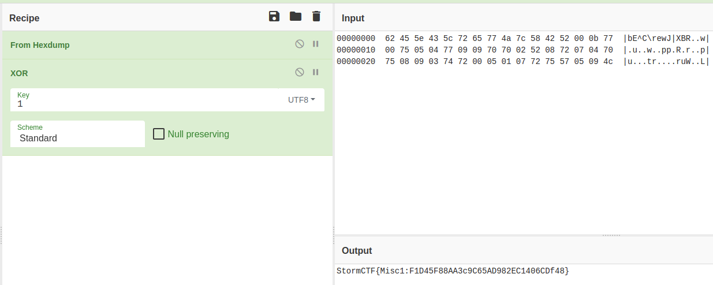

# Kirby!

So it seems Kirby did it's thing again...


So we Download it, make a suitable directory and store it there

```
$ cd 

$ mkdir -p ctf/guidepoint/feb16/kirby

$ mv Downloads/challenge.png ctf/guidepoint/feb16/kirby

$ cd ctf/guidepoint/feb16/kirby/
```


And then, we use our eyes to hack. We're in ParrotOS, so we use the Eye of Mate

```

$ eom challenge.png

```


So, nothing very obvious. We now use binwalk, which let's us check if there are any embeded files inside other file (a common technique on steganography)

```

$ binwalk challenge.png

```


## Aha!

So there's a .zip file inside named flag.zip. That must be our flag. So how do we get it out of there? binwalk provides and extraction mode, which (obviously) extracts every file for examination. Then:

```

$ binwalk -e challenge.png

```


## Ahaha!

So we unzip it, not before doing the mandatory zipinfo


Huh? An extra png file? Let's ignore it for now and see the flag!

```
$ cat flag.txt
```

### Drumroll

# WAT

So not what I was expecting, however this does look like the output of hexdump.


Lets not ignore the .png 


So this now looks like the UI for Cyberchef (https://gchq.github.io/CyberChef) Let's reverse the order of the operations!



# YAS!

We submit the flag and get our first 200 points!
