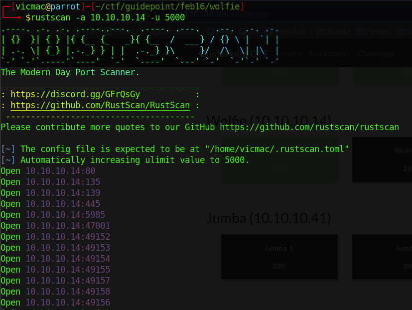
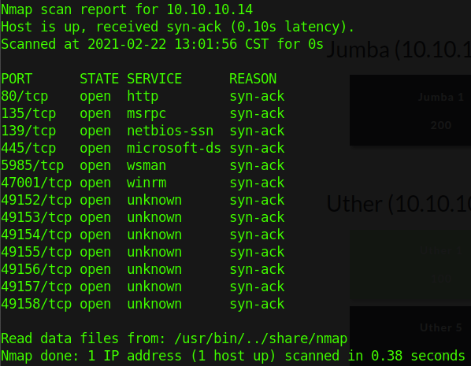
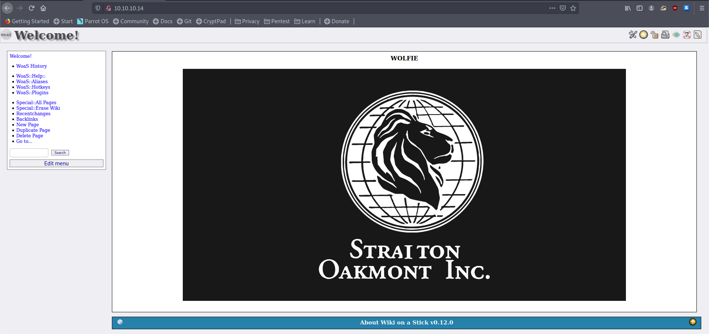
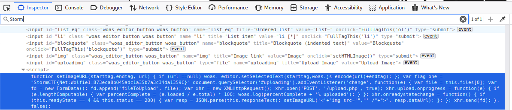

We just get an IP, so we run a quick scan using rustscan

```

$ rustscan -a 10.10.10.14 -u5000

```




We have port 80, so let's connect.



A little bit of googling shows it's "Woas or Wiki on a Stick". Meh. Let's check the source code first.



# o.o

Cool! 100 pts!