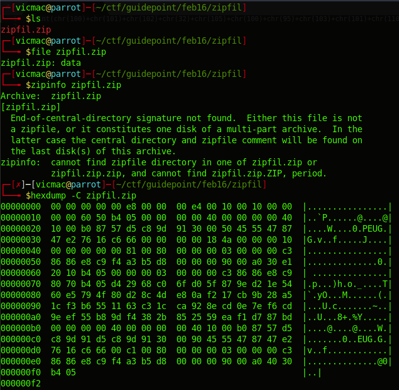

# Zipfil

We're given a file to download and extract the flag from it.

Upon close examination, the .zip file is corrupted or is not a .zip file.

I lack enough knowledge to go on, I tried zipping it again to see if the flag popped out in the compressed payload but nothing interesting came out. Sorry! :(